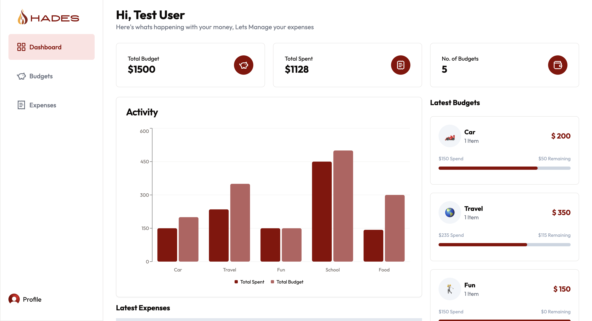

# Hades - Full Stack Financial Tracker
Live Application: https://hades-full-stack-financial-tracker.vercel.app/

## Table of Contents
- [Introduction](#introduction)
- [Preview](#preview)
- [Features](#features)
- [Technologies Used](#technologies-used)
- [Usage](#usage)

## Introduction
Hades is a Full Stack Expense Tracker designed to help users manage their personal finances by tracking their expenses. The application provides a user-friendly interface to log and categorize expenses and visualize spending patterns through charts and reports.

## Preview
Hero
> 

DashBoard
> 

Budgets
> 

Expenses
> 

## Features
- User authentication and authorization
- Add, edit, and delete expenses
- Categorize expenses
- View detailed reports and charts
- Responsive design for mobile and desktop

## Technologies Used
### Frontend
- React
- Shchad.cn UI

### Backend
- Next.js
- Neon Postgres Database
- Drizzle ORM

### Other Tools
- Clerk for authentication

## Usage
- Register a new account or log in with existing credentials.
    - Test User Provided: 
        - Username: test_user
        - Password: hades_test
- Navigate to the dashboard to view your overall spending.
- Add, edit, or delete expenses in the 'Expenses' section.
- View reports and charts in the 'Reports' section to analyze your spending patterns.
